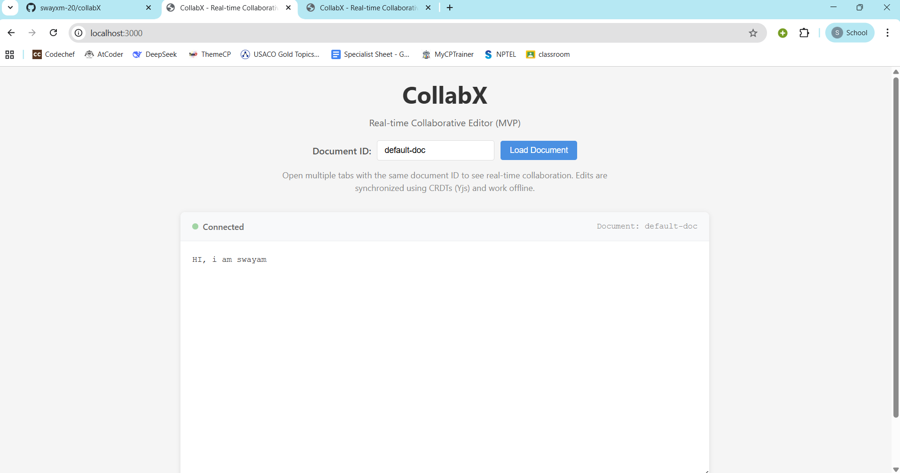
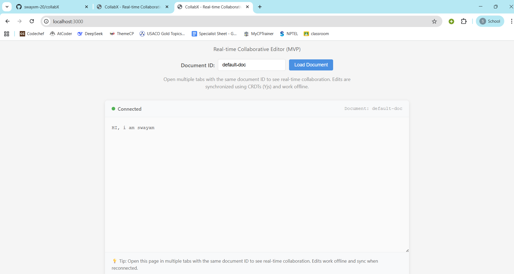

# CollabX - Real-time Collaborative Editor (MVP)

<div align="center">


**A minimal but production-ready real-time collaborative text editor built with CRDTs and WebSockets**

[Features](#-features) • [Quick Start](#-quick-start) • [Architecture](#️-architecture) • [Demo](#-demo)

[](https://www.typescriptlang.org/)
[](https://reactjs.org/)
[](https://fastapi.tiangolo.com/)
[](https://github.com/yjs/yjs)
[](https://developer.mozilla.org/en-US/docs/Web/API/WebSocket)

</div>

---

## 📋 Table of Contents

- [Overview](#-overview)
- [Features](#-features)
- [Demo](#-demo)
- [Quick Start](#-quick-start)
- [Architecture](#️-architecture)
- [Project Structure](#-project-structure)
- [Technical Details](#-technical-details)
- [Design Decisions](#-design-decisions)
- [Future Improvements](#-future-improvements)
- [Contributing](#-contributing)

## 🎯 Overview

CollabX is a **minimal but correct** real-time collaborative web application that demonstrates:

- ✅ **Real-time multi-user editing** with WebSockets
- ✅ **Offline-tolerant design** using CRDTs (Yjs)
- ✅ **Clean frontend–backend separation**
- ✅ **Zero-conflict editing** - automatic merge of simultaneous edits
- ✅ **Production-ready architecture** - suitable for interviews and demos

This MVP is designed to be **small, stable, easy to run locally**, and perfect for live demonstrations.

## ✨ Features

### Core Capabilities

- 🔄 **Real-time Synchronization** - See edits from other users instantly
- 📴 **Offline Support** - Continue editing without internet, syncs when reconnected
- 🔀 **Conflict-Free Merging** - CRDTs ensure all clients converge to the same state
- 🚀 **Fast & Lightweight** - Minimal dependencies, optimized for performance
- 🎨 **Clean UI** - Simple, intuitive interface focused on collaboration
- 🔌 **Auto-Reconnect** - Automatic reconnection with exponential backoff

### Technical Highlights

- **Stateless Backend** - Simple WebSocket relay, no database required
- **Binary Protocol** - Efficient CRDT updates via binary WebSocket messages
- **Type-Safe** - Full TypeScript implementation
- **Well-Documented** - Comprehensive code comments and architecture docs

## 🎬 Demo

### Screenshots

#### Main Editor Interface

*The main collaborative editor interface showing the connected state, document ID control, and text editor with "HI, i am swayam" content*

#### Real-time Collaboration

*Multiple browser tabs editing the same document simultaneously - changes appear in real-time across all connected clients*

#### Connection Status

*Editor showing connection status indicator (green dot = connected) and document information*

### Live Demo

To see CollabX in action:

1. **Start the backend:**
   ```bash
   cd backend
   uvicorn main:app --reload
   ```

2. **Start the frontend:**
   ```bash
   cd frontend
   npm run dev
   ```

3. **Open multiple browser tabs** at `http://localhost:3000` and start typing!

## 🚀 Quick Start

### Prerequisites

- **Python 3.8+** with `pip`
- **Node.js 16+** with `npm`

### Installation

#### 1. Clone the Repository

```bash
git clone https://github.com/swayxm-20/collabX.git
cd collabX
```

#### 2. Backend Setup

```bash
# Navigate to backend
cd backend

# Install dependencies
pip install -r requirements.txt

# Start the server
uvicorn main:app --reload
```

The backend will be available at `http://localhost:8000`

#### 3. Frontend Setup

```bash
# Navigate to frontend (in a new terminal)
cd frontend

# Install dependencies
npm install

# Start the development server
npm run dev
```

The frontend will be available at `http://localhost:3000`

### Testing Real-time Collaboration

1. Open `http://localhost:3000` in your browser
2. Open the same URL in **another browser tab** (or window)
3. Type in one tab - you should see the text appear in the other tab **in real-time** ⚡
4. Try **disconnecting** one tab (stop the backend) and typing - edits are stored locally
5. **Reconnect** - the state converges correctly when the backend is restarted

## 🏗️ Architecture

### High-Level Architecture

```
┌─────────────────────────────────────────────────────────────┐
│                        CollabX Architecture                  │
└─────────────────────────────────────────────────────────────┘

┌─────────────┐         ┌─────────────┐         ┌─────────────┐
│   Client 1  │         │   Client 2  │         │   Client 3  │
│             │         │             │         │             │
│  ┌───────┐  │         │  ┌───────┐  │         │  ┌───────┐  │
│  │ Yjs   │  │         │  │ Yjs   │  │         │  │ Yjs   │  │
│  │ CRDT  │  │         │  │ CRDT  │  │         │  │ CRDT  │  │
│  └───┬───┘  │         │  └───┬───┘  │         │  └───┬───┘  │
│      │      │         │      │      │         │      │      │
└──────┼──────┘         └──────┼──────┘         └──────┼──────┘
       │                        │                        │
       │  Binary Updates        │                        │
       │  (Uint8Array)          │                        │
       └────────────────────────┼────────────────────────┘
                                │
                    ┌───────────▼───────────┐
                    │   FastAPI Backend     │
                    │   WebSocket Relay     │
                    │                       │
                    │  Room: {doc_id}       │
                    │  Broadcast to all     │
                    │  (except sender)      │
                    └───────────────────────┘
```

### Key Components

#### Frontend (React + TypeScript + Vite)
- **Yjs CRDT** - Conflict-free replicated data types for automatic merging
- **WebSocket Client** - Real-time binary update transmission
- **React Hooks** - Modern, functional component architecture
- **TypeScript** - Full type safety throughout

#### Backend (FastAPI)
- **WebSocket Endpoint** - `/ws/{doc_id}` for document rooms
- **Stateless Relay** - No conflict resolution, just broadcasting
- **Room Management** - Automatic cleanup on disconnect
- **Binary Protocol** - Efficient CRDT update transmission

#### CRDT (Yjs)
- **Automatic Merging** - Commutative and associative operations
- **Offline Support** - Local operation storage
- **Vector Clocks** - Efficient state synchronization
- **No Server Logic** - All conflict resolution on client

### Data Flow

#### Local Edit Flow
```
User Input → textarea onChange → Yjs Transaction → 
CRDT Update → WebSocket Send → Backend → 
Broadcast to Other Clients
```

#### Remote Update Flow
```
WebSocket Receive → Y.applyUpdate() → 
CRDT Merge → Yjs Text Change → 
textarea Update (with cursor preservation)
```

#### Offline Edit Flow
```
User Input → Yjs Local Storage → 
(Network Disconnected) → 
Reconnect → State Sync → 
All Clients Converge
```

## 📁 Project Structure

```
collabX/
├── backend/
│   ├── main.py              # FastAPI WebSocket server
│   ├── requirements.txt     # Python dependencies
│   ├── setup.ps1            # Windows setup script
│   └── setup.sh             # Linux/Mac setup script
│
├── frontend/
│   ├── index.html           # HTML entry point
│   ├── package.json         # Node dependencies
│   ├── vite.config.ts       # Vite configuration
│   ├── tsconfig.json        # TypeScript config
│   └── src/
│       ├── main.tsx         # React entry point
│       ├── App.tsx          # Main app component
│       ├── App.css          # App styles
│       ├── Editor.tsx       # Collaborative editor component
│       ├── Editor.css       # Editor styles
│       ├── socket.ts        # WebSocket client
│       └── index.css        # Global styles
│
├── docs/
│   └── screenshots/         # Screenshot directory
│
└── README.md                # This file
```

## 🔧 Technical Details

### WebSocket Protocol

- **Endpoint:** `ws://localhost:8000/ws/{doc_id}`
- **Message Format:** Binary (Uint8Array) - Yjs CRDT updates
- **Connection Lifecycle:**
  - Client connects → joins room
  - Client sends update → server broadcasts to all other clients in room
  - Client disconnects → removed from room (automatic cleanup)

### CRDT Implementation

- **Library:** [Yjs](https://github.com/yjs/yjs) (`yjs` npm package)
- **Data Type:** `Y.Text` for text content
- **Update Encoding:** 
  - `Y.encodeStateAsUpdate()` - Encode document state
  - `Y.applyUpdate()` - Apply remote updates
- **Conflict Resolution:** Automatic via CRDT properties (commutativity, associativity)

### Offline Tolerance

- Yjs stores all operations locally in memory
- Edits work seamlessly without network connection
- On reconnection, Yjs syncs state using vector clocks
- All clients converge to the same state eventually (eventual consistency)

### Performance Optimizations

- **Binary Protocol** - Efficient CRDT update encoding
- **Echo Suppression** - Updates not sent back to sender
- **Automatic Reconnection** - Exponential backoff strategy
- **Cursor Preservation** - Approximate cursor position on remote updates

## 🎯 Design Decisions

### Why CRDTs?

- ✅ **No server-side conflict resolution** - Reduces backend complexity
- ✅ **Offline-first** - Edits work without network
- ✅ **Eventual consistency** - All clients converge to the same state
- ✅ **Scalable** - Can add more clients without server logic changes
- ✅ **Mathematically proven** - CRDTs guarantee convergence

### Why Stateless Backend?

- ✅ **Simplicity** - Backend is just a relay, easy to understand
- ✅ **No database needed** - Reduces dependencies and complexity
- ✅ **Easy to scale** - Can add Redis pub/sub later without changing client code
- ✅ **Clear separation** - Backend doesn't need to understand document structure

### Why Plain Textarea?

- ✅ **MVP focus** - Demonstrates core collaboration without UI complexity
- ✅ **Easy to understand** - No rich text editor abstractions
- ✅ **Fast to implement** - Focus on real-time sync, not formatting
- ✅ **Future-proof** - Can upgrade to rich text editor later

## 🚧 Future Improvements

This MVP is intentionally minimal. Here are improvements for a production system:

### Infrastructure
- 🔴 **Redis Pub/Sub** - Scale beyond single server
- 🔴 **Persistent Storage** - Save documents to database (PostgreSQL, MongoDB)
- 🔴 **Load Balancing** - Multiple backend instances
- 🔴 **Nginx Reverse Proxy** - Production deployment
- 🔴 **Docker Compose** - One-command setup

### Features
- 🔴 **Authentication & Authorization** - User accounts, permissions
- 🔴 **Cursor Awareness** - Show where other users are typing
- 🔴 **Document History** - Version control, undo/redo
- 🔴 **Rich Text Editor** - Formatting, images, tables (using Yjs rich text types)
- 🔴 **Document Snapshotting** - Periodic snapshots for faster initial load
- 🔴 **Presence Indicators** - Show who's online
- 🔴 **Document List** - Browse and create documents

### Performance
- 🔴 **Update Batching** - Batch rapid edits before sending
- 🔴 **Compression** - Compress binary updates
- 🔴 **Delta Updates** - Send only changes, not full state
- 🔴 **CDN** - Serve static assets

### Developer Experience
- 🔴 **TypeScript Strict Mode** - Better type safety
- 🔴 **Unit Tests** - Test CRDT convergence
- 🔴 **Integration Tests** - Test WebSocket flow
- 🔴 **Error Handling** - Better error messages and recovery
- 🔴 **CI/CD** - Automated testing and deployment

## 🤝 Contributing

This is a minimal MVP project. Contributions are welcome! Here's how you can help:

1. **Fork the repository**
2. **Create a feature branch** (`git checkout -b feature/amazing-feature`)
3. **Commit your changes** (`git commit -m 'Add some amazing feature'`)
4. **Push to the branch** (`git push origin feature/amazing-feature`)
5. **Open a Pull Request**

### Areas for Contribution

- 🐛 Bug fixes
- 📝 Documentation improvements
- 🎨 UI/UX enhancements
- ⚡ Performance optimizations
- 🧪 Test coverage
- 🔒 Security improvements

## 📝 License

This is an MVP/demo project. Use as needed for learning and interviews.

## 🙏 Acknowledgments

- [Yjs](https://github.com/yjs/yjs) - CRDT library for conflict-free collaboration
- [FastAPI](https://fastapi.tiangolo.com/) - Modern, fast web framework
- [React](https://reactjs.org/) - UI library
- [Vite](https://vitejs.dev/) - Next-generation frontend tooling

---

<div align="center">

**Built with ❤️ using React, TypeScript, Vite, Yjs, FastAPI, and WebSockets**

[⭐ Star this repo](https://github.com/swayxm-20/collabX) if you find it helpful!

</div>
